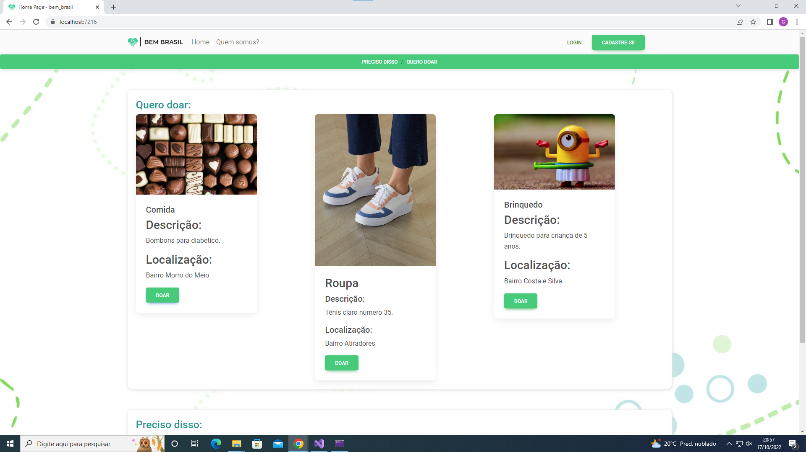

# Bem Brasil

O objetivo do site é unir o doador com quem precisa de algum item, com a maior transparência possível, para quem assim possamos eliminar toda a falta de comunicação que hoje existe no nosso sistema de doação.
Atualmente o sistema que utilizamos para fazer doações gira em torno de ONGS que fazem esse trabalho sem transparência suficiente deixando nos em dúvida em relação a se o item foi realmente enviado para quem necessita ou se o foi extraviado.

Por exemplo eu tenho certa desconfiança em realizar doações para certas ONGS pelo tamanho, afinal o intuito por fora pode ser bom mas não sabemos o real intuito e nem para quem é entregue o produto.
Em nosso site realizamos o contato direto entre beneficente e beneficiário para que não haja dúvidas a conduta do mesmo. Nosso site visa a segurança máxima dos usuários.
Utilizamos o VisualStudio como IDE e a arquitetura MVC tentando maximizar o uso da clean architecture, para o banco de dados utilizamos o SSMS com o SQL SERVER.

Fizemos conexões com API Externas ao nosso site como a API VIACEP
Tentamos ao máximo utilizar do cleancode e de ferramentas como o LINQ e Entity para consultas ao banco de dados

# Base do site

> Clique aqui para ver o [vídeo demonstrativo](https://youtu.be/fv0LCXc3ioU)

## Criadores:

- Gabriel Pereira Portella : <[GitHub](https://github.com/gbzzera7) - [Linkedin](https://www.linkedin.com/in/gabriel-pereira-portella-6b8413238/)>

- Gabriel Retzlaff : <[GitHub](https://github.com/R3TZgl) - [Linkedin](https://www.linkedin.com/in/gabriel-retzlaff-348314239/)>

- Gustavo da Silva de Souza : <[GitHub](https://github.com/gusssouza) - [Linkedin](https://www.linkedin.com/in/gustavo-s-souza-319794222/)>

- Luis Fillipe Venturini Quintino : <[GitHub](https://github.com/LuisQuintino) - [Linkedin](https://www.linkedin.com/in/lu%C3%ADs-fillipe-venturini-quintino-a50614226/)>

- Nicolas do Nascimento Carvalho : <[GitHub](https://github.com/RASROWDK) - [Linkedin](https://www.linkedin.com/in/nicolas-do-nascimento-carvalho-b1885222a/)>
